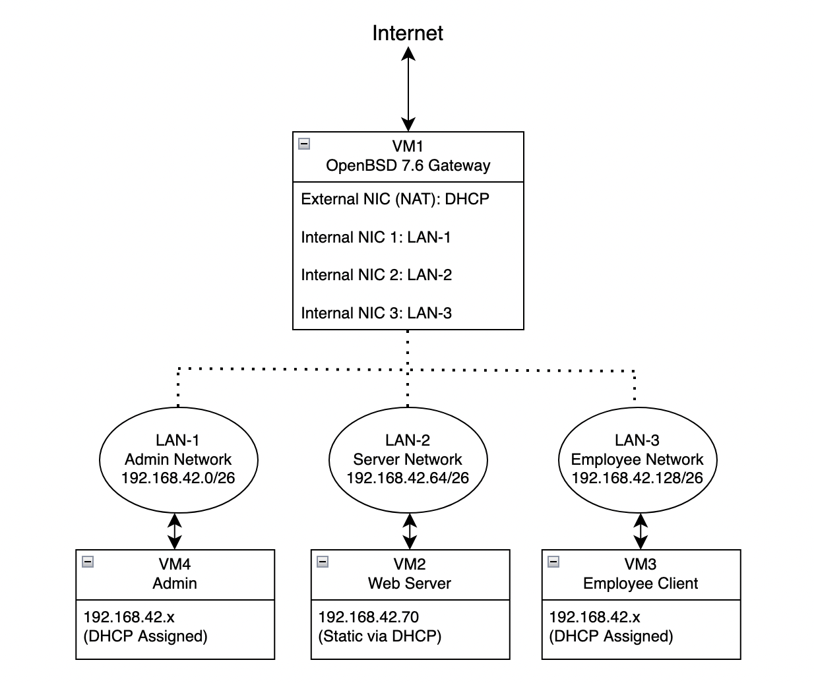

# You Shall Not Pass

## Content
- [Technologies Used](#technologies-used)
- [Infrastructure](#infrastructure)
    - [Virtual Machines](#virtual-machines)
    - [Private Network Interfaces Rules](#private-network-interfaces-rules)
    - [Infrastructure Schema](#infrastructure-schema)
    - [Firewall Rules](#firewall-rules)
- [Configurations](#configurations)
    - [Before you start: Private Networks](#before-you-start-private-networks)
    - [VM1 - Gateway](#vm1---gateway)
        - [Prerequisites](#prerequisites)
        - [VMWare](#vmware)
        - [OS Installation](#os-installation)
        - [Back to VMWare](#back-to-vmware)
        - [Network Interfaces](#network-interfaces)
        - [DHCP](#dhcp)
        - [Routing and Internet Access](#routing-and-internet-access)
        - [DNS](#dns)
        - [Firewall with Packet Filter](#firewall-with-packet-filter)
        - [Optional: Internet Access Issue](#optional-internet-access-issue)
    - [VM3 (Employee) and VM4 (Administration)](#vm3-employee-and-vm4-administration)
        - [Prerequisites](#prerequisites-1)
        - [VMWare](#vmware-1)
        - [OS Installation](#os-installation-1)
        - [Back to VMWare](#back-to-vmware-1)
        - [Make user a sudoer](#make-user-a-sudoer)
        - [Connect to DHCP server](#connect-to-dhcp-server)
    - [VM2 (Server)](#vm2-server)
        - [Requirements for this machine](#requirements-for-this-machine)
        - [Prerequisites](#prerequisites-2)
        - [VMWare](#vmware-2)
        - [OS Installation](#os-installation-2)
        - [Back to VMWare](#back-to-vmware-2)
        - [DHCP Static IP](#dhcp-static-ip)
        - [SSH connection between VM1 and VM2 for Ansible](#ssh-connection-between-vm1-and-vm2-for-ansible)
        - [Ansible](#ansible)
        - [Send .zip resource file to VM2](#send-zip-resource-file-to-vm2)
        - [PHP 7.4 Installation](#php-74-installation)
        - [Webserver installation](#webserver-installation)
        - [Additional configs](#additional-configs)

> [!NOTE]
> In this documentation, blocks that start with 📚 emojii or in NOTE block are for educational purposes (for explaining elements or some keywords. If you are not a beginner, you can  skip those blocks and continue following instructions). Also, links with 📋 emojii are links to full config files. 

# Technologies Used
> [!NOTE] 
> Technologies were chosen either by project requirements (like OS) or by hardware limitations for Apple silicon (VMWare)

- VMWare Fusion (Free Version)
- OS: OpenBSD, FreeBSD, Debian Bookworm 
- Tool: Ansible

# Infrasturcture
## Virtual Machines
The infrastucture consists of 4 virtual machines:
1. VM1 - Gateway
    - OS: OpenBSD 7.6
    - has 4 network cards: NAT and 3 private
    - DHCP and DNS server
    - declares firewall rules
2. VM2 - Server
    - OS: FreeBSD 14
    - acts as NGINX and MySQL server
3. VM3 - Employee
    - OS: Debian 12
    - has GUI
4. VM4 - Administration
    - OS: Debian 12
    - has GUI        

## Private Network Interfaces Rules
1. lan-1: administration
    - network : 192.168.42.0
    - broadcast : 192.168.42.63
    - range DHCP : 192.168.42.40 - 192.168.42.60
2. lan-2: server
    - network : 192.168.42.64
    - broadcast : 192.168.42.127
    - range DHCP : 192.168.42.70 - 192.168.42.110
3. lan-3: employee
    - network : 192.168.42.128
    - broadcast : 192.168.42.191
    - range DHCP : 192.168.42.140 - 192.168.42.180 

## Infrasturcture Schema



## Firewall rules
For security reasons, right segregation and access control must be applied:
- **administration LAN** can reach any server through the server network, on all ports.
- **employee LAN** can reach only reach the server on *HTTP* and *HTTPS* protocols.
- **employee**, **administration** and **server LANs** can go out on the *internet*, *ping devices* on another subnet, and *retrieve DHCP and DNS* information from the gateway.

# Configurations
The plan is to firstly configure **gateway**, then create client VMs (**employee** and **administration**) to test firewall rules, dhcp/dns configs and internet connection, and after that create **server** VM and configure it with help of Ansible. 

## Before you start: Private Networks
Before creating first VM, it is necessary to create 3 private custom networks:
- open VMWare general settings (`command` + `,`)
- go to Network tab
- on the left bottom, click the lock to make changes
- click on **+** on the left bottom 3 times. It will create 3 custom network cards. For now leave all configs as they are. They will be changed later after the creation of the first VM. 
    - by double clicking on the name, you can change it. For the better comprehension, I have named mine `lan-1`, `lan-2`, and `lan-3`. 

## VM1 - Gateway
Here we need to configure our network cards, DHCP and DNS servers, as well as firewall fules as per requirements above described in **Infrastructure** section. 

### Prerequisites
- [Download](https://www.openbsd.org/faq/faq4.html#Download) OpenBSD 7.6 `iso` image (`install76.iso` file for `arm64` (Apple Silicon))

### VMWare:
1. click on **+** on the top left corner -> **New**
2. drag downloaded `.iso` file to the specified place
3. for OS system - choose **Other** > **Other 64-bit arm**
4. do not click on **Finish** yet, instead, click on **Customise Settings**, choose name of the VM, and **Save**. 
5. in the settings, go to **Processors & Memory**, choose 2 cores and 2048 MB of memory
6. next got to **Hard Disk (NVMe)** and choose 20GB of memory on Virtual Disk.
7. go to Network Adapter and make sure that **SHare with my Mac** option is chosen, and well as on top **Connect Network Adapter** box is ticked.
8. next, on the top right corner, click on **Add Device...**, choose **Network Adapter**, and from the list choose `lan-1` custom network. Repeat the process for `lan-2` and `lan-3`. Always make sure that box for **Connect Network Adapter** is chosen.

### OS installation
1. Choose `Installation` (type `I`)
2. For keyboard choice, if you need QWERTY, choose `default` (just click on `Enter`)
3. Hostname name: `gateway`
4. Network interface to configure: type `em0`

> [!NOTE]
> In OpenBSD usually names of network interfaces are `emX`, for our inftrastructure, `em0` is NAT, and `em1`, `em2`, and `em3` are private network interfaces. 
    - IPv4 address for em0? - type `dhcp`
    - IPv6 adress for em0? - leave none (just click on `Enter`)
<br/>

> [!NOTE]
>  **IPv4**: Format: XXX.XXX.XXX.XXX (e.g., 192.168.42.1). Used widely but limited due to exhaustion of available addresses. **IPv6**: Format: XXXX:XXXX:XXXX:XXXX:XXXX:XXXX:XXXX:XXXX (e.g., 2001:0db8:85a3:0000:0000:8a2e:0370:7334).

5. Next network to configure is em1. Type `em1`. 
    - symbolic name: `lan-1`
    - IPv4 adress for em1: `192.168.42.1/26` (it is a static IP address within the subnet. The first usable IP in each subnet is assigned to the gateway interface. `/26` is netmask that = `255.255.255.192`. This subnet mask splits the IP range into groups of 64 addresses.)
6. Now the same with `em2`:
    - symbolic name: `lan-2`
    - ip: `192.168.42.65/26`
7. For `em3`:
    - symbolic name: `lan-3`
    - ip: `192.168.42.129/26`            
8. DNS domain name: you can choose default
9. Password for root account: type whiever you wish
10. Start sshd (8) by default? - type `yes`
11. Create a user? - type `no` (usually you need a user, for this project exactly for simplicity I will use root user for VM1 and VM2 - generally **not** recommended)
12. Allow root ssh login? - type `yes` (generally **not** recommended as it is security risk. Again, for simplicity of the infrastructure I will aloow it)
13. What timezone are you in? - just click on `Enter`
14. Which disk is the root disk? Type `Enter` for default value
15. Encrypt the root disk? - `no`
16. Use whole disk and accept default layout.
17. Location of sets? (cd0 disk http nfs or 'done') - type `cd0` (since you use `.iso` image to istall this OS)
18. Pathname to the sets - type on `Enter`
19. Set name - `done` 
20. Directory does not contain SHA256.sig, continue without verification? - `yes`
21. After installation - `reboot`

### Back to VMWare 
1. After the reboot, log in as root user using your password. Check the following commands: 
    - `ifconfig` check if 4 network interfaces are there (`em0`, `em1`, `em2`, `em3`)
    - `ifconfig em1` must have inet `192.168.42.1`
    - `ifconfig em2` must have inet `192.168.42.65`
    - `ifconfig em3` must have inet `192.168.42.129`
    - `ping -c 1 8.8.8.8` must be successful and lost packages must be at 0%
    - `ping -c 1 google.com` must be successful and lost packages must be at 0%
2. Go to the **general settings** of the VMWare > **Network**.
3. As before, unlcok the possibility to change by clicking on the lock.
4. Go to `lan-1` network. There, change first Subnet Mask value to `255.255.255.192` and Subnet IP to `192.168.42.0`. Make sure that from all the options, only `Connect the host Mac to this network` is chosen. Untick all the rest. 
5. Repeat the same with `lan-2`:
    - Subnet Mask: `255.255.255.192`
    - Subnet IP: `192.168.42.64`
6. And with `lan-3`:
    - Subnet Mask: `255.255.255.192`
    - Subnet IP: `192.168.42.128` 
7. Apply all of the changes and close settings. 

### Network Interfaces
Configure files for network interfaces:
- `/etc/hostname.em0`
- `/etc/hostname.em1`
- `/etc/hostname.em2`
- `/etc/hostname.em3`

There you need to verify (or write if no yet correct) static ip of the interface, netmask, and add keyword `up`, that is used to indicate that the network interface should be enabled (brought "up") during system boot.

📋 You can find correct version of files [here](https://github.com/yanamlnk/you-shall-not-pass/tree/main/VM1/network).

### DHCP 
Configure DHCP in the file `/etc/dhcpd.conf`. It is normal that this file does not exist. The DHCP server configuration file needs to be created manually when you set up a DHCP server.

1. `touch /etc/dhcpd.conf`
2. `chmod 644 /etc/dhcpd.conf`
3. `vi /etc/dhcpd.conf` to edit the file. 

📋 Find the file [here](https://github.com/yanamlnk/you-shall-not-pass/blob/main/VM1/dhcp/dhcpd.conf).
- to check if file does not have any syntax errors: `dhcpd -n -f -d em1 em2 em3`

❗️ Important note:
- this line `hardware ethernet 00:00:00:00:00:00;` will be configured later. For now you can comment the whole block `host server` with help of `#`.

📚 Explanation for the elements:
- `option domain-name "local"` - sets the domain name for the DHCP clients.
- `host server { ... }` - defines a specific client with a static IP (`192.168.42.70`) assigned based on its MAC address (`hardware ethernet`).
- `subnet 192.168.42.x netmask 255.255.255.192 { ... }` - configures the IP range, router, broadcast address, and DNS for the network. After `subnet` is IP of the subnet - network adress, and then netmask, meaning that the last number can change in this subnet. 
- `range ...` - defines the dynamic IP range within each subnet for DHCP clients.
- `option routers ...` - specifies the default gateway for clients in the subnet (address = first usable address in the subnet). The gateway IP (or router IP) is the address of the device that routes traffic between the local subnet and other networks (e.g., the internet).
- `option broadcast-address ...` - sets the broadcast address for the subnet (address = last address in the subnet). The broadcast address is a special IP address used to send messages to all devices on a specific subnet.
- `option domain-name-servers ...` - defines the DNS server(s) for clients in the subnet.

4. Create the `/etc/rc.conf.local` file if it doesn't already exist. In OpenBSD, this file is used to override default system settings and specify custom configurations.
5. Set correct permissions:
    - `chown root:wheel /etc/rc.conf.local`
    - `chmod 600 /etc/rc.conf.local`
6. In this file, add the line: `dhcpd_flags="em1 em2 em3"`. This tells the system to run the DHCP server on the em1, em2, and em3 interfaces (your private LAN interfaces).
7. Start dhcp service: 
    - `rcctl enable dhcpd`
    - `rcctl start dhcpd`

📚 When you create next machines, you can check if DHCP server is working correctly by checking DHCP leases here: `/var/db/dhcpd.leases`. There you will see which IP was given and to which machine.

### Routing and Internet Access
1. Create a file: `echo "net.inet.ip.forwarding=1" > /etc/sysctl.conf`
2. Set the correct permissions:
    - `chown root:wheel /etc/sysctl.conf`
    - `chmod 640 /etc/sysctl.conf`

This will allow the system to forward packets between different networks (LANs and the internet).

To immediately enable IP forwarding, you can run this command:
`sysctl net.inet.ip.forwarding=1`.

To check if IP forwarding is enabled: `To immediately enable IP forwarding, you can run this command:
`sysctl net.inet.ip.forwarding`. If it shows `1` - it is enabled, `0` - not enabled.

📚`net.inet.ip.forwarding` is a system control (sysctl) setting that determines whether the operating system forwards IPv4 packets between network interfaces. If you have multiple network interfaces and want your OpenBSD system to route traffic between them (e.g., in a gateway or router setup), you need to enable net.inet.ip.forwarding.

### DNS
1. Add the following lines to the file `/var/unbound/etc/unbound.conf`: 
```
server:       
    interface: 192.168.42.1 # em1
    interface: 192.168.42.65 # em2 
    interface: 192.168.42.129 # em3

    access-control: 192.168.42.0/26 allow # LAN-1 network 
    access-control: 192.168.42.64/26 allow # LAN-2 network 
    access-control: 192.168.42.128/26 allow # LAN-3 network
    do-udp: yes
    do-tcp: yes

forward-zone: 
    name: "." 
	forward-addr: 8.8.8.8
	forward-addr: 8.8.4.4
```

📋 Full file can be found [here](https://github.com/yanamlnk/you-shall-not-pass/blob/main/VM1/dns/unbound.conf).

📚 In OpenBSD, **Unbound** is a validating, recursive, and caching DNS resolver. It is included in the base system and serves as a lightweight and secure DNS service. It is primarily used to resolve DNS queries locally and cache responses for faster subsequent lookups.

📚 Elements of the file:
- `server:` configures Unbound's server behavior, including network interfaces, access controls, and query handling.
- `interface:` specifies which network interfaces Unbound listens on for DNS queries. Unbound will only respond to DNS queries received on these IP addresses.
- `access-control:` defines rules for allowing or denying DNS query access based on client IP ranges.
- `do-udp: yes` - enables DNS resolution over UDP, the default transport for most DNS queries
- `do-tcp: yes` - enables DNS resolution over TCP, which is used when responses exceed the UDP size limit or for DNSSEC validation.
- `forward-zone:` configures Unbound to forward DNS queries to external resolvers, such as public DNS servers
- `name: "."` - the `"."` indicates the root zone, meaning this configuration applies to all DNS queries.
- `forward-addr:` - specifies the upstream DNS servers to which Unbound forwards queries. Unbound acts as a forwarder in this setup, sending queries to these upstream resolvers for names it cannot resolve locally.

2. Check if config is valid: `unbound-checkconf`. If mistake is `/var/unbound/db/root.key: No such file or directory unbound-checkconf`:
    - Create file: `unbound-anchor -a /var/unbound/db/root.key`
    - Verify it was created: `ls -l /var/unbound/db/root.key`
    - Give permissions: `chown _unbound:_unbound /var/unbound/db/root.key` and `chmod 644 /var/unbound/db/root.key`
3. In `/etc/rc.conf.local` add this line: `unbound_flags=`

📚 You don’t need to specify the flags, because it will rely on configuration file (`/var/unbound/etc/unbound.conf`). 

4. Restart Unbound: `rcctl restart unbound`
5. Restart dhcpd: `rcctl restart dhcpd`

### Firewal with Packet Filter
Packet Filter is OpenBSD built-in firewall.
PF controls the flow of traffic between interfaces and enforces rules about which types of network traffic are allowed to pass through the system.

1. Edit the `/etc/pf.conf` file. You can find full file [here](https://github.com/yanamlnk/you-shall-not-pass/blob/main/VM1/firewall/pf.conf). 
2. Reload PF configuration `pfctl -f /etc/pf.conf`
3. Enable PF if it's not enabled yet `pfctl -e` and pf service: `rcctl enable pf`
4. Add the following line to the `/etc/rc.conf.local`: `pf=YES`

To check PF rules: `pfctl -sr`

📚Some details for the file:
- `pass`/`block`/`match`:
	- `pass`: allows traffic that matches the rule's criteria to pass through. `pass in` - to the mentioned interface, `pass out` - from the mentioned interface
	- `block`: blocks traffic that matches the rule's criteria. Works same with `in` and `out` as `pass`
 	- `match`: modifies or applies special handling to traffic (e.g., NAT or QoS). It does not block or pass traffic but works alongside other rules

- `keep state`: tracks the state of a connection. Once a connection is established, return traffic matching the same state is automatically allowed without needing additional rules. This is essential for protocols like TCP, which involve multiple packets for a single session

- configuration options (`set` commands):
	- `set optimization aggressive`: optimizes firewall performance with an "aggressive" profile, which is suitable for high-throughput or low-latency environments. It affects how PF manages states and timeouts.
	- `set ruleset-optimization basic`: simplifies the ruleset to improve efficiency during processing. This "basic" optimization focuses on straightforward reductions like collapsing redundant rules.
	- `set skip on lo0`: skips filtering on the loopback interface (`lo0`). This is common since loopback traffic is typically local-only and trusted.
	- `set block-policy return`: specifies how blocked packets are handled. The `return` policy sends a rejection (e.g., TCP RST for TCP packets or ICMP Unreachable for others) back to the sender. This contrasts with a `drop` policy, which silently discards packets.
	- `set state-policy if-bound`: limits state tracking to the interface where the connection was established. This is useful in multi-homed environments, ensuring state entries are interface-specific, improving security.

 - `match in all scrub` - normalizes incoming traffic, correcting any anomalies (like overlapping fragments). This makes packets safer and more predictable to process.
	- `no-df`: removes the "Don't Fragment" flag from packets, ensuring compatibility with MTU-based fragmentation.
	- `random-id`: replaces predictable packet IDs with random ones to enhance security against spoofing and tracking.

 - Network Address Translation (NAT) (`nat-to ($ext_if)`): translates the source address of outgoing packets to the external interface's IP. This is key for allowing private (internal) networks to access external resources like the internet.


### Optional: Internet Access Issue
❗️ Do not do this step until you test internet connection in other VMs. 

Generally, it is possible what with all these configurations you will have Internet access just on VM2 running on FreeBSD and not on the others. But you will receive internet access on VM3 and VM4 after reboot of VM1 (exactly reboot!) or after running the command `sh /etc/netstart`.

This suggests that there's a state issue with PF rules or NAT translation table that gets reset during reboot. One reason for this could be the ordering of PF rules and interface initialization during boot. This is common in virtualized environments, especially with VMware Fusion, where network interface initialization timing can sometimes cause issues.

Why then FreeBSD has internet? Some reasons:
- The timing of DHCP requests and responses
- How different operating systems (FreeBSD vs Debian) handle network interface initialization
- The static vs dynamic nature of the configurations (FreeBSD server has static ip)

Very general fix for this issue:
1. Create a script `/usr/local/sbin/network-init.sh`:
```
#!/bin/sh

# Initialize interfaces
sh /etc/netstart

# Reload PF
pfctl -f /etc/pf.conf
```
2. Make it executable: `chmod +x /usr/local/sbin/network-init.sh`

3. Add this script a cron job: `crontab -e`
4. Add this line to make the script execute itself every minute: `* * * * * /usr/local/sbin/network-init.sh`. You can add your line anywhere after the PATH and HOME settings but before the end of the file.

## VM3 (Employee) and VM4 (Administration)
### Prerequisites
- [Download](https://www.debian.org/distrib/netinst) Debian 12 `iso` image for `arm64`.

### VMWare:
1. click on **+** on the top left corner -> **New**
2. drag downloaded `.iso` file to the specified place
3. do not click on **Finish** yet, instead, click on **Customise Settings**, choose name of the VM, and **Save**. 
4. in the settings, go to **Processors & Memory**, choose 2 cores and 2048 MB of memory
5. next got to **Hard Disk (NVMe)** and choose 20GB of memory on Virtual Disk.
6. go to Network Adapter and make sure that **Share with my Mac** option is chosen, and well as on top **Connect Network Adapter** box is ticked. It will be changed, but for instalaltion, we need Internet connection.

### OS installation
1. Choose graphical interface for simplicity.
2. Language: `English`
3. Country Territory: `US`
4. Keymap: for QWERTY - `American English`
5. Hostname: `employee` for VM3, `administration` for VM4
6. Domain name: empty
7. Root password - choose whatever you want
8. Full name for the user with non-administrative activities: `employee` for VM3, `administration` for VM4
9. Same for user name
10. For time - choose any. I have chosen `Central`
11. Partitioning method: `Guided - use entire disk`
12. Select list to partition: select the `default`
13. Partitioning scheme: `all files in one partition`
14. Next click on `Finish partitioning` and write changed to disk. Confirm changes
15. Scan extra installation media? `No`
16. Debian archive mirror country: choose yours
17. Debian archive mirror: choose default one (first one)
18. HTTP proxy: leave empty
19. Participate in survey: no
20. Choose software to install: Check `SSH server`, `standard system utilities`, and `…GNOME` (for GUI)
21. After the installation, press `Continue` to reboot

### Back to VMWare
Once the machine is started, on the top you have `<...>` button (to the right of the 🔧 button).  Click on this button, then on **Network Adapter Settings**, and there choose `lan-3` private network for **VM3(Employee)** machine, and `lan-1` for **VM4(Administration)**.

### Make user a sudoer
1. Once you see the screen to log in as a user, click on `fn` + `control` + `option` + `F3` to open CLI. 
2. Type user `root` and a password you have chosen for a root.
3. Make user a sudoer: 
    - for employee: `usermod -aG sudo employee`
    - for administration: `usermod -aG sudo administration`

### Connect to DHCP server
1. check the name of the network with `ip a`
2. Add the following lines to `/etc/network/interfaces` (change ens160 to the name of your network): 
```
auto ens160
allow-hotplug ens160
iface ens160 inet dhcp
```
📋 Full files are [here](https://github.com/yanamlnk/you-shall-not-pass/blob/main/VM3/interfaces) (for employee) and [here](https://github.com/yanamlnk/you-shall-not-pass/blob/main/VM4/interfaces) (for administration).

3. Add ip of the corresponding subnets to the file `/etc/resolv.conf`:
    - for employee: `nameserver 192.168.42.129`
    - for administration: `nameserver 192.168.42.1`

📋 Full files are [here](https://github.com/yanamlnk/you-shall-not-pass/blob/main/VM3/resolv.conf) (for employee) and [here](https://github.com/yanamlnk/you-shall-not-pass/blob/main/VM4/resolv.conf) (for administration).

4. Restart networking: `systemctl restart networking`
5. To check if DHCP is working correctly, run `dhclient -v ens160`, where ens160 is the name of the network.
    - here: `DHCPACK of 192.168.42.161 from 192.168.42.129` you should see first IP to be in the range configured in `dhcpd.conf` file in the VM1, and second IP must be the IP of the gateway (configured in the previous step)

To restart DHCP connection: `dhclient -r ens160`, and to start again: `dhclient ens160`

## VM2 (Server)
### Requirements for this machine:
- server should always get the same IP (192.168.42.70) and the configuration must be in DHCP mode.
- install and setup a NGINX web server
- install also php7.4 and required modules
- deploy the page provided (`data.php`).
- install mysql80-server using the system port and install the provided `nsa501` database
- create a user for this database with the following features:
    - user: backend
    - rights: All rights on nsa501 table
    - password: Bit8Q6a6G.

📎 Additional files provided [here](https://github.com/yanamlnk/you-shall-not-pass/blob/main/VM2/app_t-nsa-501.zip).

### Prerequisites
- [Download](https://download.freebsd.org/releases/arm64/aarch64/ISO-IMAGES/14.2/) FreeBSD 14 `iso` image for `arm64` (file called `FreeBSD-14.2-RELEASE-arm64-aarch64-disc1.iso`).

### VMWare:
1. click on **+** on the top left corner -> **New**
2. Click on `Create custom virtual machine`
3. Choose `FreeBSD 14 64-bit Arm`
4. Create a new virtual disk for 20GB
5. Customise Settings: On `CD/DVD` select your ISO and tick on `Connect CD/DVD drive`.
6. Select one more time 2 cores and 2048 memory.
7. On Network Adapter and make sure that **Share with my Mac** option is chosen, and well as on top **Connect Network Adapter** box is ticked. It will be changed, but for instalation, we need Internet connection.

### OS installation
1. Boot installer -> Install
2. Choose keyboard - for qwerty just press `Enter`
3. Hostname: `server`
4. Choose optional system components to install: Choose all except `lib32-dbg`, `tests`, `base-dbg`, and `kernel-dbg` *(you need to press space to select)*.
5. Network configs: 
    - Choose network interface
    - Configure IPv4? `yes`
    - Use DHCP: `yes`
    - Configure IPv6: `no`
    - Enable wireless: `no`
6. For partitioning:
    - Choose "Auto (ZFS)"
    - Select "stripe" for pool type
    - Choose your virtual disk
    - Use default pool name "zroot"
    - Select GPT partitioning
    - Accept default swap size
    - Select `Install` and click on `Enter`
7. Next select a mirror (just `default`)
8. Choose root password
9. Choose the needed timezone and date (or just press `Enter` for defaults)
10. For system configuration, enable sshd.
11. After everything - `reboot`

Don’t forget to delete an ISO from CD/DVD (`disconnect from CD/DVD`).

Next, you can restart and start `Boot`. 

### Back to VMWare
Once the machine is started, on the top you have `<...>` button (to the right of the 🔧 button).  Click on this button, then on **Network Adapter Settings**, and there choose `lan-2` private network.

### DHCP Static IP
1. from the result of command `ifconfig`, save the value of `ether` of `em0` (in the format `xx:xx:xx:xx:xx:xx`).
2. Configure `/etc/rc.conf`: add the value of the `ther` to the field `ifconfig_em0`: `ifconfig_em0="DHCP ether 00:00:00:00:00:00" `. 

📋 Full file [here](https://github.com/yanamlnk/you-shall-not-pass/blob/main/VM2/rc.conf). 

3. Come back to VM1 to the file `/etc/dhcpd.conf`. Uncomment block `host server` and for the value of `hardware ethernet` write down you Mac adress taken from VM2. 

### SSH connection between VM1 and VM2 for Ansible
1. Temporary allow ssh in `/etc/ssh/sshd_config`:
    - `PermitRootLogin yes`
    - `PasswordAuthentication yes`
2. Restart ssh: `service sshd restart`
3. In VM1, do the same (`vi /etc/ssh/sshd_config`). Restart ssh: `rcctl restart sshd`
4. On VM1, generate ssh key: `ssh-keygen -t ed25519 -C "ansible"`. Select default file (`/root/.ssh/id_ed25519`) and empty passphrase. 
5. Send public key to VM2. From VM1: 
```
cat /root/.ssh/id_ed25519.pub | ssh root@192.168.42.70 "mkdir -p /root/.ssh; chmod 700 /root/.ssh; cat >> /root/.ssh/authorized_keys; chmod 600 /root/.ssh/authorized_keys"
```
6. Test the connection from VM1: `ssh root@192.168.42.70`. If connection does not require pass and is successfuly connected, then everything is fine.

### Ansible
On VM1:
1. `pkg_add ansible`
2. `mkdir -p ~/ansible/`
3. `cd ~/ansible/`

On VM2, install Python:
1. `pkg update`
2. `pkg install python311`

📚 Ansible itself is written in Python. To execute its code, Python needs to be available on the control node (the machine where Ansible is installed), as well as on managed nodes (the target machines) to execute tasks. When you run Ansible playbooks, it typically connects to target nodes using SSH and executes Python scripts or modules to perform tasks like managing files, installing packages, or configuring services.

On VM1 (in `~/ansible`):
1. `touch inventory.ini`. Check the content of the file [here](https://github.com/yanamlnk/you-shall-not-pass/blob/main/VM1/ansible/inventory.ini). This file is used to connect to VM2 from VM1.
2. Test connectivity: `ansible webservers -i inventory.ini -m ping`. If successful:
```
server | SUCCESS => {
    "changed": false,
    "ping": "pong"
}
```
📚 `.ini` file is an inventory file used by Ansible to define the hosts (managed nodes) that it will manage, along with optional variables for configuring how Ansible interacts with each host.
- `[webservers]`: the name of a host group. A group is a collection of hosts that share a purpose or need similar configurations.
- `server`is an alias for a host. This alias is used in playbooks to reference the host, rather than using its IP address directly (in my case, it is hostname of VM2)
- `ansible_host=192.168.42.70` specifies the actual IP address (or hostname) of the target machine.
- `ansible_user=root` specifies the SSH username Ansible will use to connect to the host.
- `ansible_python_interpreter=/usr/local/bin/python3.11` specifies the Python interpreter Ansible should use on the target host. If the target host doesn't use the default `python` or `python3` path (e.g., `/usr/bin/python3`), you need to explicitly specify the correct path.

### Send .zip resource file to VM2
1. From Terminal on local machine where this file is saved, run command: `scp ~/Downloads/app_t-nsa-501.zip root@192.168.42.70:/root/`

### PHP 7.4 Installation
Since there is no more php74 in FreeBSD14, you have to install and compile it manually. for reference, on site `php.net` you can navigate to archive and find there all old files.

1. Create and edit `vi ~/ansible/install_php74.yml`

📋 Check the content [here](https://github.com/yanamlnk/you-shall-not-pass/blob/main/VM1/ansible/install_php74.yml).

2. `mkdir ~/ansible/templates` - for additional config files used by Ansible
3. `vi ~/ansible/templates/www.conf.j2` - for PHP-FPM configurations

📋 Check the content [here](https://github.com/yanamlnk/you-shall-not-pass/blob/main/VM1/ansible/www.conf.j2).

4. Run playbook on VM1: `ansible-playbook -i inventory.ini install_php74.yml`

### Webserver installation
1. Create and edit `vi ~/ansible/webserver.yml`

📋 Check the content [here](https://github.com/yanamlnk/you-shall-not-pass/blob/main/VM1/ansible/webserver.yml).

2. For Additional NGINX configs: create and edit file `vi ~/ansible/templates/nginx.conf.j2`

📋 Check the content [here](https://github.com/yanamlnk/you-shall-not-pass/blob/main/VM1/ansible/nginx.conf.j2).

3. Run playbook on VM1: `ansible-playbook -i inventory.ini webserver.yml`

4. Test nginx on VM2: `nginx -t`

### Additional configs
**PHP_FPM**
For some reason, previous process of php-fpm is not alwyas stopped after the reboot or turning off. So to be safe, once the VM2 is running, run:
```
pkill -f 'php-fpm'
service php-fpm start 
```

Or create a script:
1. `vi /usr/local/etc/rc.d/php_restart`

📋 Check the content [here](https://github.com/yanamlnk/you-shall-not-pass/blob/main/VM2/php_restart).

2. Make the script executable: `chmod +x /usr/local/etc/rc.d/php_restart`
3. Enable the script by adding this line to /etc/rc.conf: `php_restart_enable="YES"`

Also, you can run this script manually: `service php_restart start`

**IP FORWARDING**
To enable IP forwarding permanently on FreeBSD (VM2), add this line to /etc/sysctl.conf: `net.inet.ip.forwarding=1`

**ADDITIONAL FIREWALL**
If you have an issue with internet connection on VM3 and VM4 described on the section `VM1 > Optional: Internet Access Issue`, it is possible that there will be also issues with firewall after restarting network interfaces on VM1. To ensure that VM2 is protected from VM3 (VM3 should not be able to connect to VM2 via ssh), create firewall rules in VM2:
1. `touch /etc/pf.conf`
2. `vi /etc/pf.conf`. 

📋 Check the content [here](https://github.com/yanamlnk/you-shall-not-pass/blob/main/VM2/pf.conf).

3. Load the PF kernel modules: `kldload pf` and `kldload pflog`
4. To make these modules load automatically at boot, add these lines to `/etc/rc.conf`:
```
pf_enable="YES"
pf_rules="/etc/pf.conf"
pflog_enable="YES"
```
5. Load the rules: `pfctl -f /etc/pf.conf`
6. Start pf: `service pf start`
